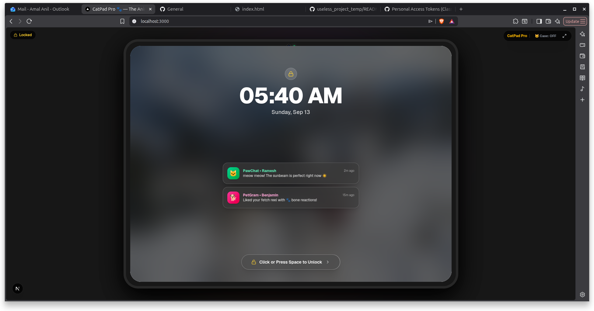
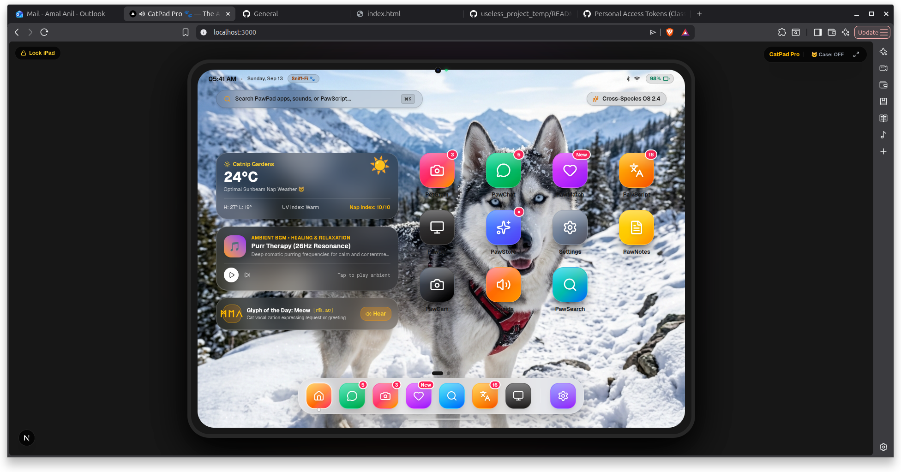
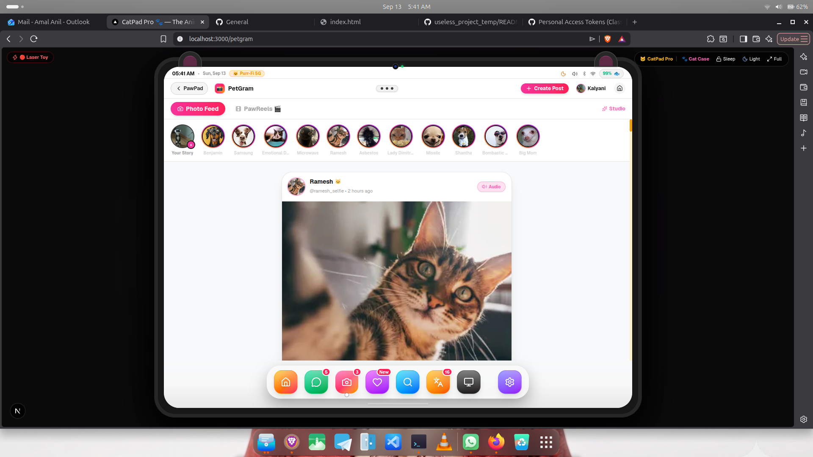
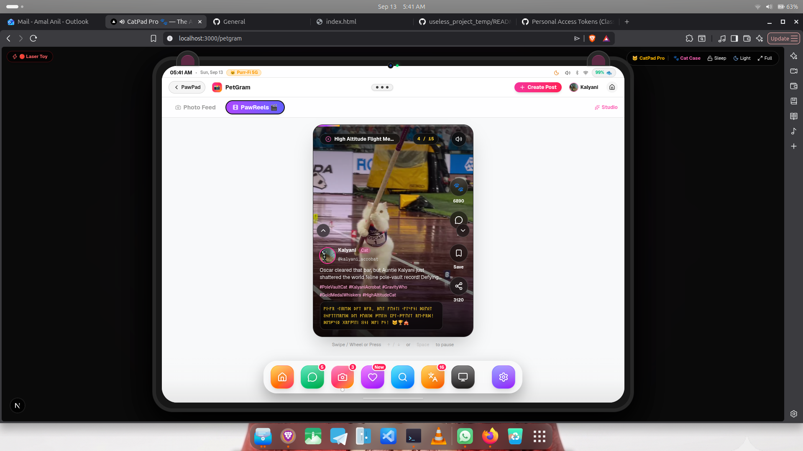
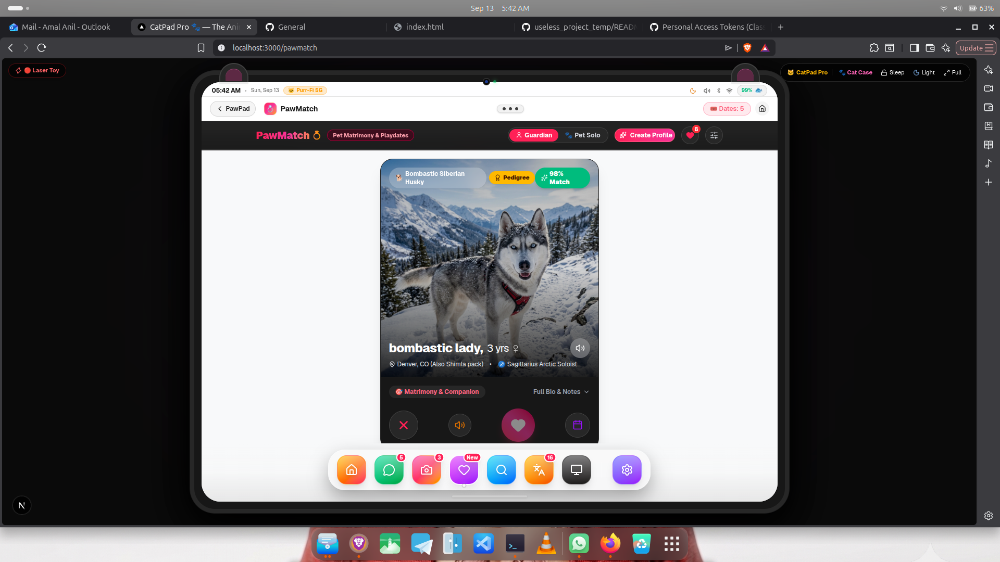
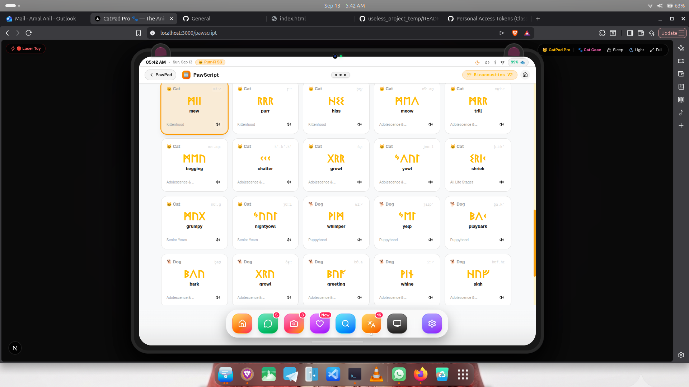
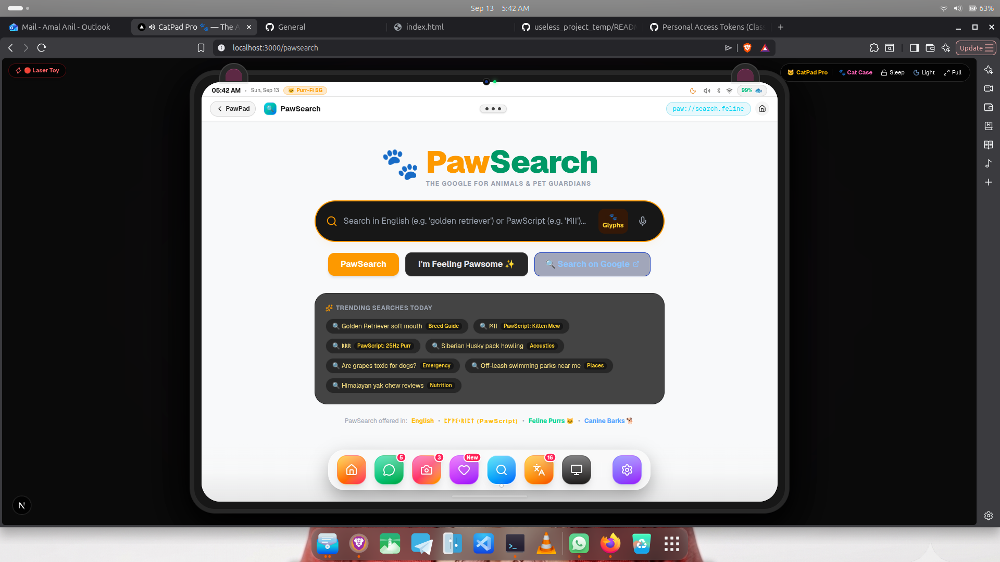
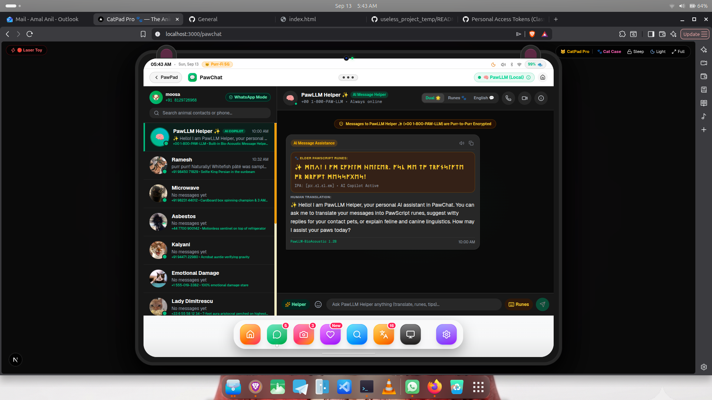
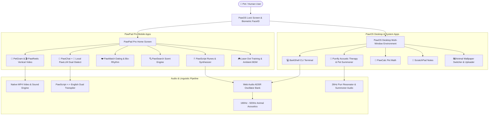

# PawLingo: PawPad Pro & PawOS 18.4 (Animal Edition) 🎯

## Basic Details
### Team Name: Bangkok

### Team Members
- Team Lead: Harinarayanan - St.Thomas College Ranni
- Member 2: Amal Anil - St.Thomas College Ranni

### Project Description
PawLingo is the world’s first inter-species operating system (PawOS) and simulated iPad (PawPad Pro) engineered exclusively for domestic pets. It equips cats, dogs, and critters with a full social media ecosystem (PetGram & PawReels), phone-authenticated dual-dialect AI chat (PawChat + PawLLM), bio-rhythm matchmaking (PawMatch), an olfactory scent engine (PawSearch), acoustic sound therapy (Purrify), an animal Linux shell (BarkShell), and real-time Web Audio runic phoneme synthesis (PawScript).

### The Problem (that doesn't exist)
For over 30,000 years of domestication, humans have arrogantly assumed that dogs barking at delivery trucks and cats staring blankly into empty ceiling corners were merely "being animals." In reality, our pets have been suffering from acute digital disenfranchisement. They are trapped watching boring human television, cannot doomscroll short-form video reels during 3:00 AM zoomies, cannot find romantic matches based on mutual nap compatibility, cannot soothe their separation anxiety with 26Hz purr acoustic resonance, and possess no standardized cross-species cryptographic messaging protocol to negotiate peace treaties over salmon treats while humans are away at work.

### The Solution (that nobody asked for)
We built **PawPad Pro running PawOS 18.4 (Animal Edition)** — an absurdly comprehensive simulated operating system and iPad ecosystem that gives domestic animals full digital autonomy:
1. **PawOS Desktop Environment (`/pawos`):** A complete multi-window desktop operating system featuring draggable floating windows, minimize/maximize/dock controls, and animal-first productivity tools.
2. **BarkShell Terminal CLI (`bsh`):** An authentic Linux-style terminal for domestic animals with built-in commands (`bark`, `purr`, `meow`, `sniff`, `treat`, `zoomies`, `fetch`, `whoami`, `cat`, `ls`, `help`, `stop`, `exit`) paired with real-time sound synthesis and background audio tracking with instant cutoff on exit.
3. **Purrify Acoustic Studio:** Sound therapy station delivering looping 26Hz feline healing vibrations, canine anti-separation anxiety rhythmic breathing, and an interactive pet summoner soundboard (wet food can pop, 900Hz squeaker toy, doorbell chime, ultrasonic dog whistle).
4. **PetGram & PawReels (`/petgram`, `/petgram/reels`):** A high-velocity social network where pets doomscroll 9:16 vertical video reels with synchronized audio, PawScript comment streams, bone/paw reactions, soundboards, randomized non-repeating pet photo media, and custom photo/video uploading (`/petgram/create`).
5. **PawChat & Local PawLLM (`/pawchat`):** A WhatsApp/iMessage hybrid featuring mobile phone authentication, a roster of pet contacts, and a single-message Local AI Assistant that translates and replies simultaneously in both conversational English and runic PawScript glyphs.
6. **PawMatch Dating Engine (`/pawmatch`):** An inter-species companion discovery app where pets swipe right or left, calculate bio-rhythm sniff compatibility, view personality badges (Zoomie Champion, Expert Loafer), and celebrate matches with confetti.
7. **PawSearch Scent Engine (`/pawsearch`):** An olfactory search bar simulating 802.11p Sniff-Fi radar, tracking down local fire hydrants, squirrels, dropped bacon, and catnip reserves.
8. **PawScript Phonetic Synthesizer (`/pawscript`):** A complete 16-rune phonetic alphabet paired with Web Audio ADSR oscillators (180Hz to 920Hz), synthesizing animal acoustics (purrs, trills, hisses, barks) into cryptographic runes with IPA phonetic notation.
9. **Animal Wallpaper Gallery & Custom Pet Photos:** Switch between 10 curated animal themes (Benjamin Scholar, Husky in Snow, Playful Shiba, Bengal Leopard, Cozy Bunny, Cyber Fox) or upload custom pet wallpapers via file picker or image URL.
10. **Simulated Tablet Experience & Utilities:** Simulated iPad frame and bezel UI with playful cat ear bumpers, simulated biometric pet FaceID unlock, interactive laser dot training arcade, and ambient animal acoustic background audio.

## Technical Details
### Technologies/Components Used
For Software:
- **Languages used:** TypeScript, JavaScript (ES2024), CSS3, HTML5
- **Frameworks used:** Next.js 16 (Turbopack, App Router), React 19, TailwindCSS v4
- **Libraries used:** Framer Motion (fluid spring physics & gesture animations), Lucide React (featherweight icons), Canvas Confetti
- **Tools used:** Web Audio API (custom ADSR oscillator synthesizers for animal frequencies & active audio tracking), LocalStorage State Persistence Engine, Node.js, npm, ESLint

For Hardware:
*(N/A — PawLingo is a 100% software-based web application. No custom physical hardware is required.)*
- **Target Devices:** Any modern laptop, desktop, iPad, Android tablet, or smartphone
- **Audio Output:** Standard speakers or headphones (for Web Audio API animal acoustic frequency synthesis)
- **Input:** Touchscreen, mouse, or trackpad (paw-friendly UI targets)
- **Display:** Any modern web browser display (Chrome, Safari, Firefox, Edge)

### Implementation
For Software:

# Installation
```bash
# Clone the repository
git clone https://github.com/amalaniltrue/useless_project_temp.git

# Navigate into the project directory
cd useless_project_temp

# Install all dependencies
npm install
```

# Run
```bash
# Start the Next.js development server with Turbopack
npm run dev

# Open http://localhost:3000 in your browser to launch PawPad Pro!
# Or visit http://localhost:3000/pawos to explore the PawOS Desktop!
```

### Project Documentation
For Software:

# Screenshots (Add at least 3)









# Diagrams

*System Architecture: Seamless inter-species execution flow connecting hardware shell, desktop window manager, multimedia feeds, local AI language modeling, and Web Audio acoustics.*

For Hardware:

# Schematic & Circuit
*(N/A — Pure software application; no physical circuits or hardware components required.)*

# Build Photos
*(N/A — Pure software application; runs directly in any modern web browser.)*

### Project Demo
# Video

[](https://drive.google.com/file/d/1Xo0QI-QP_UBfnEWIE6eAcVW4mhYtkIVc/view?usp=sharing)

🔗 **Full Project Screen Recording Video:** [https://drive.google.com/file/d/1Xo0QI-QP_UBfnEWIE6eAcVW4mhYtkIVc/view?usp=sharing](https://drive.google.com/file/d/1Xo0QI-QP_UBfnEWIE6eAcVW4mhYtkIVc/view?usp=sharing)

| Video Demo | Feature Focus | Walkthrough Highlights |
| :--- | :--- | :--- |
| [🎥 **Full Screen Recording Demo**](https://drive.google.com/file/d/1Xo0QI-QP_UBfnEWIE6eAcVW4mhYtkIVc/view?usp=sharing) | **Complete PawLingo Ecosystem Walkthrough** | Full high-definition end-to-end screen recording demonstrating PawPad Pro, PawOS Desktop, BarkShell, Purrify, PetGram, PawReels, PawChat, PawMatch, PawSearch, and PawScript bioacoustics. |
| [▶️ **Watch Demo 1: PawScript Bioacoustics**](videos/01_pawscript_bioacoustics_demo.webm) | **PawScript Bioacoustics V2 & Phonetics Engine** | Full walkthrough of the 16-rune animal alphabet, real-time bioacoustic synthesis, live natural speech to PawScript translator, typing pad, and audio oscillator playback. |
| [▶️ **Watch Demo 2: PawSearch Scent Engine**](videos/02_pawsearch_scent_engine_demo.webm) | **PawSearch Olfactory Scent Engine & Navigation** | Demonstrates searching in runic PawScript glyphs, query translation to English web results, phonetic transcriptions, and biological animal sound sample playback. |
| [▶️ **Watch Demo 3: PetGram & PawReels**](videos/03_petgram_pawreels_demo.webm) | **PetGram & PawReels Short-Form Video Feed** | Demonstrates vertical 9:16 video reels doomscrolling, synchronized audio tracks, live PawScript comment streams, bone & paw reactions, and app navigation. |

> [!NOTE]
> The full project screen recording is hosted on [Google Drive](https://drive.google.com/file/d/1Xo0QI-QP_UBfnEWIE6eAcVW4mhYtkIVc/view?usp=sharing). Additional individual screencasts are stored in the [`videos/`](videos/) directory.

# Additional Demos
- Live Local Web Server: `http://localhost:3000`
- PawOS Desktop Environment: `http://localhost:3000/pawos`
- PetGram Social Feed: `http://localhost:3000/petgram`
- PawReels Video Player: `http://localhost:3000/petgram/reels`
- PetGram Creator Studio: `http://localhost:3000/petgram/create` (Upload custom photos and videos)
- PawChat AI Helper: `http://localhost:3000/pawchat`
- PawMatch Dating: `http://localhost:3000/pawmatch`
- PawScript Synthesizer: `http://localhost:3000/pawscript`
- PawSearch Scent Engine: `http://localhost:3000/pawsearch`

## Team Contributions
- **Harinarayanan**: Project ideation & conceptualization, UI/UX design, acoustic sound curation, inter-species interaction testing, and technical documentation.
- **Amal Anil**: Full-Stack Architecture, PawOS Desktop Window Manager, BarkShell CLI Terminal, Purrify Sound Therapy Studio, PetGram & PawReels video engine, PawLLM dual-dialect translation pipeline, PawScript Web Audio ADSR synthesizer, hydration shield, and Animal Wallpaper system.

---
Made with ❤️ at TinkerHub Useless Projects 


